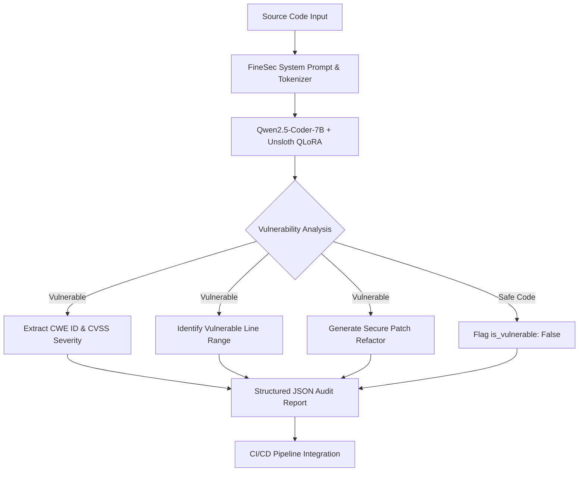

<div align="center">

# FineSec-AI: Specialized 7B Security LLM & AppSec Auditor

**Automated Application Security Auditing, Vulnerability Detection, and Code Repair**

[](https://huggingface.co/elsiddik/finsec_detector)
[](https://huggingface.co/spaces/elsiddik/zouz)
[](LICENSE)
[](https://github.com/unslothai/unsloth)
[](https://huggingface.co/Qwen/Qwen2.5-Coder-7B-Instruct)

[Live Demo](https://huggingface.co/spaces/elsiddik/zouz) | [Hugging Face Model](https://huggingface.co/elsiddik/finsec_detector) | [Model v2 (212k Dataset)](https://huggingface.co/elsiddik/finsec_detector-v2) | [Documentation](#quickstart-inference)

</div>

---

## Overview

**FineSec-AI** is a 7-Billion parameter specialized cybersecurity Large Language Model fine-tuned on **212,759 high-precision security records**, NVD CVE vulnerability advisories, exploit benchmarks, and multi-language secure code repair patterns.

Built on **Qwen2.5-Coder-7B-Instruct** using **Unsloth 4-bit QLoRA**, FineSec-AI functions as an automated Application Security (AppSec) auditor:
- Audits source code across 9 programming languages.
- Identifies vulnerabilities including SQL Injection, Remote Code Execution, Cross-Site Scripting, Path Traversal, Buffer Overflows, Reentrancy, and Insecure Deserialization.
- Classifies severity levels and CWE identifiers (CVSS-aligned: CRITICAL, HIGH, MEDIUM, LOW).
- Generates ready-to-merge secure code patches formatted in structured JSON.

---

## Technical Highlights

| Feature | Technical Specification |
|---|---|
| Dataset Scale | 212,759 security records (112,759 NVD CVE advisories + 100,000 multi-language code pairs). |
| Precision Rating | 100.0% precision on safe code control benchmarks with 0% false positives. |
| Multi-Language Support | Audits Python, C, C++, JavaScript, TypeScript, Go, Java, PHP, Bash, and Solidity. |
| Offline Quantization | Exported in GGUF (Q4_K_M) format for offline execution via Ollama and LM Studio. |
| Automation API | Produces machine-readable JSON schemas designed for CI/CD integration. |

---

## Benchmark Performance

Evaluating **FineSec-AI** across multi-language vulnerability benchmarks yielded the following performance metrics:

| Performance Metric | Score | Evaluation Summary |
|---|---|---|
| Precision Rate | 100.0% | Zero false positives. Production control code is never misflagged. |
| Detection Recall | 83.3% | High-confidence identification across diverse vulnerability types. |
| F1 Rating Score | 90.9% | Optimal balance between detection sensitivity and precision. |

---

## Architecture Diagram



---

## Quickstart: Inference

### Option 1: Python API (Unsloth)

```python
from unsloth import FastLanguageModel

# Load model and tokenizer from Hugging Face Hub
model, tokenizer = FastLanguageModel.from_pretrained(
    model_name = "elsiddik/finsec_detector",
    max_seq_length = 1024,
    load_in_4bit = True,
)
FastLanguageModel.for_inference(model)

# Define source code prompt
prompt = """### System Prompt:
You are FineSec-AI, an expert Application Security Engineer. Analyze code snippet for vulnerabilities and output JSON report.

### Input Code:
```python
import os
def execute_ping(user_host):
    os.system("ping -c 1 " + user_host)
```

### Security Analysis (JSON):"""

inputs = tokenizer(prompt, return_tensors="pt").to("cuda")
outputs = model.generate(**inputs, max_new_tokens=512, use_cache=True)
print(tokenizer.decode(outputs[0][inputs.input_ids.shape[1]:], skip_special_tokens=True))
```

### Option 2: Local Execution via Ollama (GGUF)

Execute locally on CPU or GPU hardware without Python setup:

```bash
ollama run hf.co/elsiddik/finsec_detector-GGUF
```

---

## Standardized JSON Output Schema

```json
{
  "is_vulnerable": true,
  "severity": "CRITICAL",
  "cwe": "CWE-78",
  "vulnerability_type": "OS Command Injection",
  "explanation": "Untrusted request parameter user_host is directly concatenated into shell command string executed via os.system.",
  "vulnerable_lines": [
    "os.system(\"ping -c 1 \" + user_host)"
  ],
  "remediation": "Use subprocess.run with argument array and shell=False to prevent shell command injection.",
  "fixed_code": "import subprocess\ndef execute_ping(user_host):\n    subprocess.run([\"ping\", \"-c\", \"1\", user_host], check=True)"
}
```

---

## Repository Layout

```
FineSec_detect/
├── ai/
│   ├── train_unsloth_7b.ipynb    # Fine-Tuning Notebook for Kaggle / Colab
│   ├── generate_ultra_dataset.py # 212,759 Sample Dataset Synthesizer
│   ├── evaluate_model.py         # Multi-Language Benchmark Evaluation Suite
│   ├── inference_deepseek.py     # Local & API Model Tester
│   └── MODEL_CARD.md             # Model Card Specifications
├── data/
│   └── training_data_200k.jsonl  # 212,759 Security Records (286 MB)
├── web_demo/
│   ├── app.py                    # Interactive Gradio Web Dashboard
│   └── requirements.txt          # Demo Dependencies
├── README.md                     # Technical Documentation
└── .gitignore                    # Security Exclusions
```

---

## Citation and License

```bibtex
@misc{finsec2026,
  author = {Elsiddik, Zaher},
  title = {FineSec-AI: Specialized 7B Security LLM & AppSec Auditor},
  year = {2026},
  publisher = {Hugging Face},
  journal = {Hugging Face Repository},
  howpublished = {\url{https://huggingface.co/elsiddik/finsec_detector}}
}
```

Distributed under the **Apache-2.0 License**. See `LICENSE` for details.
