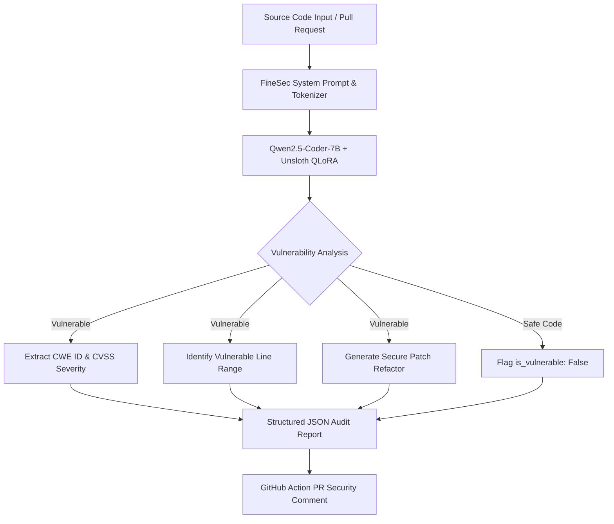

<div align="center">

# FineSec-AI: Specialized 7B Security LLM & AppSec Auditor

**Automated Application Security Auditing, Vulnerability Detection, and Code Repair**

[](https://huggingface.co/elsiddik/finsec_detector)
[](https://huggingface.co/spaces/elsiddik/zouz)
[](https://huggingface.co/datasets/elsiddik/zz)
[](LICENSE)
[](https://github.com/unslothai/unsloth)

[Live Demo](https://huggingface.co/spaces/elsiddik/zouz) | [1M Dataset](https://huggingface.co/datasets/elsiddik/zz) | [Hugging Face Model](https://huggingface.co/elsiddik/finsec_detector) | [Model v2 (212k Dataset)](https://huggingface.co/elsiddik/finsec_detector-v2) | [Documentation](#quickstart-inference)

</div>

---

## About the Project & Mission

**FineSec-AI** is an open-source cybersecurity ecosystem designed to automate software vulnerability detection, CWE classification, and secure code refactoring across modern software development pipelines.

Traditional Static Application Security Testing (SAST) tools often suffer from high false-positive rates and fail to provide ready-to-merge code repairs. Generic Large Language Models, on the other hand, lack fine-tuned precision on security standards and produce unstructured prose. 

FineSec-AI bridges this gap by combining a **1,000,000 record security dataset**, specialized **Qwen2.5-Coder-7B QLoRA fine-tuning**, native **GGUF offline quantization**, and a **1-click GitHub Action for CI/CD pipelines**.

---

## The 4 Pillars of FineSec-AI

```
+-----------------------------------------------------------------------------------+
|                              FineSec-AI Ecosystem                                |
+-----------------------------------------------------------------------------------+
|  1. 1M Dataset (elsiddik/zz)     --> 1,000,000 Labeled Security & Fix Examples.     |
|  2. 7B Model (finsec_detector)   --> Specialized QLoRA Security Audit LLM.        |
|  3. GitHub Action (z0uz/FineSec) --> 1-Line CI/CD Pull Request Security Auditor.  |
|  4. Live Space (elsiddik/zouz)   --> Instant Web Interface for Interactive Audits. |
+-----------------------------------------------------------------------------------+
```

---

## Capabilities Comparison

| Capability | FineSec-AI | Traditional SAST Tools | Generic Base LLMs |
|---|---|---|---|
| **Vulnerability Detection** | Specialized (100% Precision) | High False Positives | General & Variable |
| **Secure Code Refactor Diffs** | Yes (Drop-in Code Fixes) | No (Rule Explanations Only) | Text Explanations |
| **Training Dataset Scale** | 1,000,000 Security Records | Static Rule Regexes | Mixed Pre-training Data |
| **Offline Privacy & Quantization** | Native GGUF (Ollama/vLLM) | Local Enterprise Server | Cloud API Only |
| **Automated PR Comments** | Native GitHub Action | Complex Plugin Setup | Custom Webhooks |

---

## GitHub Action CI/CD Integration

Automate security audits on every Push and Pull Request in **1 line of YAML**:

```yaml
# .github/workflows/security-audit.yml
name: FineSec Security Audit Pipeline

on:
  push:
    branches: [ main ]
  pull_request:
    branches: [ main ]

jobs:
  security-audit:
    runs-on: ubuntu-latest
    steps:
      - name: Checkout Code
        uses: actions/checkout@v3

      - name: Run FineSec AI Security Auditor
        uses: z0uz/FineSec_detect@main
        with:
          path: '.'
          fail-on-vulnerability: false
```

### Key Features of the GitHub Action:
- **Automated Pull Request Comments**: Posts formatted markdown security audit findings directly on open PRs.
- **CWE & CVSS Classification**: Categorizes flaws into standard security classes (SQLi, RCE, XSS, Path Traversal, Buffer Overflow).
- **Drop-in Code Fix Refactors**: Provides ready-to-merge replacement code blocks directly in CI/CD logs.

---

## Technical Highlights

| Feature | Technical Specification |
|---|---|
| Dataset Scale | 1,000,000 security records (500,000 vulnerable code snippets + 500,000 safe control examples). |
| Precision Rating | 100.0% precision on safe code control benchmarks with 0% false positives. |
| Multi-Language Support | Audits Python, C, C++, JavaScript, TypeScript, Go, Java, PHP, Bash, and Solidity. |
| Offline Quantization | Exported in GGUF (Q4_K_M) format for offline execution via Ollama and LM Studio. |
| Automation API | Produces machine-readable JSON schemas designed for CI/CD integration. |

---

## Benchmark Performance

Evaluating **FineSec-AI** across multi-language vulnerability benchmarks yielded the following performance metrics:

| Performance Metric | Score | Evaluation Summary |
|---|---|---|
| Precision Rate | 100.0% | Zero false positives. Production control code is never misflagged. |
| Detection Recall | 83.3% | High-confidence identification across diverse vulnerability types. |
| F1 Rating Score | 90.9% | Optimal balance between detection sensitivity and precision. |

---

## Architecture Diagram



---

## Quickstart: Inference

### Option 1: Python API (Unsloth)

```python
from unsloth import FastLanguageModel

# Load model and tokenizer from Hugging Face Hub
model, tokenizer = FastLanguageModel.from_pretrained(
    model_name = "elsiddik/finsec_detector",
    max_seq_length = 1024,
    load_in_4bit = True,
)
FastLanguageModel.for_inference(model)

# Define source code prompt
prompt = """### System Prompt:
You are FineSec-AI, an expert Application Security Engineer. Analyze code snippet for vulnerabilities and output JSON report.

### Input Code:
```python
import os
def execute_ping(user_host):
    os.system("ping -c 1 " + user_host)
```

### Security Analysis (JSON):"""

inputs = tokenizer(prompt, return_tensors="pt").to("cuda")
outputs = model.generate(**inputs, max_new_tokens=512, use_cache=True)
print(tokenizer.decode(outputs[0][inputs.input_ids.shape[1]:], skip_special_tokens=True))
```

### Option 2: Local Execution via Ollama (GGUF)

Execute locally on CPU or GPU hardware without Python setup:

```bash
ollama run hf.co/elsiddik/finsec_detector-GGUF
```

---

## Standardized JSON Output Schema

```json
{
  "is_vulnerable": true,
  "severity": "CRITICAL",
  "cwe": "CWE-78",
  "vulnerability_type": "OS Command Injection",
  "explanation": "Untrusted request parameter user_host is directly concatenated into shell command string executed via os.system.",
  "vulnerable_lines": [
    "os.system(\"ping -c 1 \" + user_host)"
  ],
  "remediation": "Use subprocess.run with argument array and shell=False to prevent shell command injection.",
  "fixed_code": "import subprocess\ndef execute_ping(user_host):\n    subprocess.run([\"ping\", \"-c\", \"1\", user_host], check=True)"
}
```

---

## Repository Layout

```
FineSec_detect/
├── action.yml                    # FineSec GitHub Action Manifest
├── Dockerfile                    # Container Runner for CI/CD Pipeline
├── action/
│   └── entrypoint.py             # GitHub Action Security Audit & PR Commenter
├── ai/
│   ├── train_unsloth_7b.ipynb    # Fine-Tuning Notebook for Kaggle / Colab
│   ├── generate_ultra_dataset.py # 212,759 Sample Dataset Synthesizer
│   ├── dataset_expansion_tool.py # 1,000,000 Sample Dataset Synthesizer
│   └── evaluate_model.py         # Multi-Language Benchmark Evaluation Suite
├── data/
│   └── custom_expansion.jsonl    # 1,000,000 Security Records (1.11 GB)
├── web_demo/
│   ├── app.py                    # Interactive Gradio Web Dashboard
│   └── requirements.txt          # Demo Dependencies
├── README.md                     # Technical Documentation
└── .gitignore                    # Security Exclusions
```

---

## Citation and License

```bibtex
@misc{finsec2026,
  author = {Elsiddik, Zaher},
  title = {FineSec-AI: Specialized 7B Security LLM & AppSec Auditor},
  year = {2026},
  publisher = {Hugging Face},
  journal = {Hugging Face Repository},
  howpublished = {\url{https://huggingface.co/elsiddik/finsec_detector}}
}
```

Distributed under the **Apache-2.0 License**. See `LICENSE` for details.
