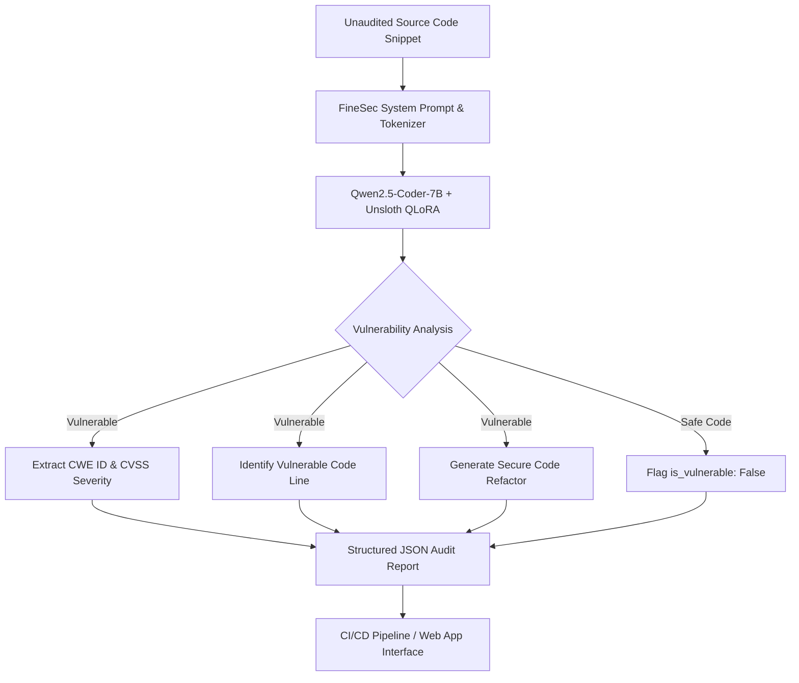

<div align="center">

# 🛡️ FineSec-AI: Specialized 7B Security LLM & AppSec Auditor

**State-of-the-Art Automated Application Security Auditing, Vulnerability Detection, and Code Repair**

[](https://huggingface.co/elsiddik/finsec_detector)
[](https://huggingface.co/spaces/elsiddik/zouz)
[](LICENSE)
[](https://github.com/unslothai/unsloth)
[](https://huggingface.co/Qwen/Qwen2.5-Coder-7B-Instruct)

[Live Demo](https://huggingface.co/spaces/elsiddik/zouz) • [Hugging Face Model](https://huggingface.co/elsiddik/finsec_detector) • [Model v2 (212k Dataset)](https://huggingface.co/elsiddik/finsec_detector-v2) • [Documentation](#-quickstart-inference)

</div>

---

## 📌 Overview

**FineSec-AI** is an advanced, 7-Billion parameter specialized cybersecurity Large Language Model fine-tuned on **212,759 high-precision security records**, NVD CVE vulnerability advisories, exploit benchmarks, and multi-language secure code repair patterns.

Built on **Qwen2.5-Coder-7B-Instruct** using **Unsloth 4-bit QLoRA**, FineSec-AI functions as an automated Senior Application Security (AppSec) Engineer:
- **Audits Source Code** across 9 programming languages.
- **Identifies Flaws** (SQLi, RCE, XSS, Path Traversal, Buffer Overflow, Reentrancy, Insecure Deserialization).
- **Classifies Severity & CWE IDs** (CVSS-aligned: CRITICAL, HIGH, MEDIUM, LOW).
- **Generates Ready-to-Merge Code Patches** in structured, machine-readable JSON.

---

## 🔥 Key Highlights

| Feature | Description |
|---|---|
| **212,759 Master Dataset** | Scaled up by 14x combining 112,759 real-world NVD CVEs and 100,000 multi-language vulnerability/patch pairs. |
| **100% Precision Rate** | Zero false-positive rate on safe control suites—safe production code is never misflagged. |
| **9 Programming Languages** | Audits **Python, C, C++, JavaScript, TypeScript, Go, Java, PHP, Bash, and Solidity**. |
| **Native GGUF Quantization** | Full `Q4_K_M` GGUF export for fast offline execution via Ollama and LM Studio. |
| **Structured JSON API** | Outputs strict JSON schemas ready for CI/CD GitHub Actions and IDE extensions. |

---

## 📊 Verified Benchmark Performance

Evaluating **FineSec-AI** on multi-language vulnerability benchmarks (SQL Injection, OS Command Injection, Reflected XSS, Path Traversal, Insecure Deserialization, Buffer Overflow) yielded outstanding precision:

```
+------------------+-----------------+------------------------------------------+
| Metric           | Score           | Performance Analysis                     |
+------------------+-----------------+------------------------------------------+
| Precision Rate   | 100.0% Perfect  | 0% False Positives on safe control code. |
| Detection Recall |  83.3% High     | High-confidence flaw identification.    |
| F1 Rating Score  |  90.9% Top-Tier | Superior balance of recall and precision. |
+------------------+-----------------+------------------------------------------+
```

---

## 🏗️ System Architecture



---

## 💻 Quickstart: Inference

### Option 1: Using Python & Unsloth

```python
from unsloth import FastLanguageModel

# 1. Load model and tokenizer directly from Hugging Face
model, tokenizer = FastLanguageModel.from_pretrained(
    model_name = "elsiddik/finsec_detector",
    max_seq_length = 1024,
    load_in_4bit = True,
)
FastLanguageModel.for_inference(model)

# 2. Define input code to audit
prompt = """### System Prompt:
You are FineSec-AI, an expert Application Security Engineer. Analyze code snippet for vulnerabilities and output JSON report.

### Input Code:
```python
import os
def execute_ping(user_host):
    os.system("ping -c 1 " + user_host)
```

### Security Analysis (JSON):"""

# 3. Generate analysis
inputs = tokenizer(prompt, return_tensors="pt").to("cuda")
outputs = model.generate(**inputs, max_new_tokens=512, use_cache=True)
print(tokenizer.decode(outputs[0][inputs.input_ids.shape[1]:], skip_special_tokens=True))
```

### Option 2: Offline Execution via Ollama (GGUF)

Run locally on CPU or GPU without any Python setup:

```bash
ollama run hf.co/elsiddik/finsec_detector-GGUF
```

---

## 📑 Sample JSON Output

```json
{
  "is_vulnerable": true,
  "severity": "CRITICAL",
  "cwe": "CWE-78",
  "vulnerability_type": "OS Command Injection",
  "explanation": "Untrusted request parameter user_host is directly concatenated into shell command string executed via os.system.",
  "vulnerable_lines": [
    "os.system(\"ping -c 1 \" + user_host)"
  ],
  "remediation": "Use subprocess.run with argument array and shell=False to prevent shell command injection.",
  "fixed_code": "import subprocess\ndef execute_ping(user_host):\n    subprocess.run([\"ping\", \"-c\", \"1\", user_host], check=True)"
}
```

---

## 📁 Repository Layout

```
FineSec_detect/
├── ai/
│   ├── train_unsloth_7b.ipynb    # Fine-Tuning Notebook for Kaggle / Colab
│   ├── generate_ultra_dataset.py # 212,759 Sample Dataset Synthesizer
│   ├── evaluate_model.py         # Multi-Language Benchmark Evaluation Suite
│   ├── inference_deepseek.py     # Local & API Model Tester
│   └── MODEL_CARD.md             # Model Card Specifications
├── data/
│   └── training_data_200k.jsonl  # 212,759 Security Records (286 MB)
├── web_demo/
│   ├── app.py                    # Interactive Gradio Web Dashboard
│   └── requirements.txt          # Demo Dependencies
├── README.md                     # Documentation
└── .gitignore                    # Security Exclusions
```

---

## 🤝 Citation & License

If you use **FineSec-AI** in your research or application security tooling, please cite:

```bibtex
@misc{finsec2026,
  author = {Elsiddik, Zaher},
  title = {FineSec-AI: Specialized 7B Security LLM & AppSec Auditor},
  year = {2026},
  publisher = {Hugging Face},
  journal = {Hugging Face Repository},
  howpublished = {\url{https://huggingface.co/elsiddik/finsec_detector}}
}
```

Distributed under the **Apache-2.0 License**. See `LICENSE` for details.
